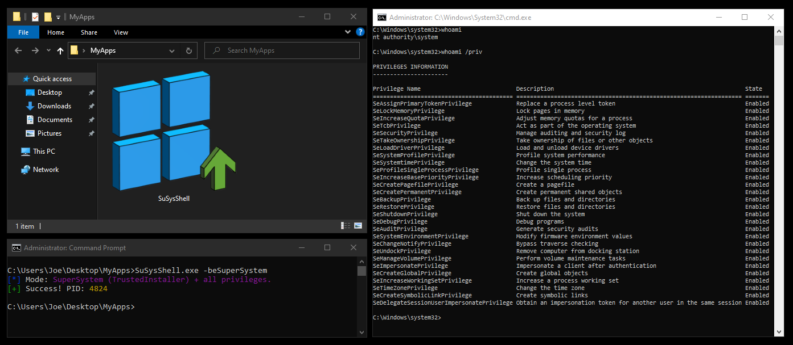

# Super System Shell (SuSysShell)

Super System Shell is a lightweight Windows system utility designed for security researchers and system administrators. It allows launching a command prompt (CMD) with SYSTEM or TrustedInstaller privileges while forcibly enabling all available privileges in the security token.



>[!WARNING]
>⚠️Important: How to Run
>
>This tool must not be launched by double-clicking the file from the File Explorer. To interact with system tokens and processes:
>Open a terminal (CMD or PowerShell) as Administrator.
>Navigate to the directory containing the utility.
>Run the tool using the command-line flags.

## Features
**SYSTEM Escalation**: *Impersonates the winlogon.exe token to gain SYSTEM-level access.*

**SuperSystem Mode**: *Starts the TrustedInstaller service, adopts its primary token, and grants all privileges.*

**Privilege Elevation**: *Iterates through the token and enables every available LUID (e.g., SeDebug, SeBackup, SeRestore).*

**ANSI Color Support**: *Clean, color-coded terminal output.*

Usage:
Run the following in an elevated CMD:

General syntax:
```bash
SuSysShell.exe [flag]
```

Examples:
```bash
SuSysShell.exe -beSystem
SuSysShell.exe -beSuperSystem
```

Flag	Description
```bash
-beSystem	Launch CMD as SYSTEM
-beSuperSystem	Launch CMD as TrustedInstaller + All Privs
-h	Display the help menu
```

Example: Transitioning to SuperSystem mode and verifying identity via whoami.
Build Instructions
To compile a clean binary without unnecessary metadata using MinGW-w64:
bash
## 1. Compile resources (icon)
`x86_64-w64-mingw32-windres resources.rc -O coff -o resources.res`

## 2. Compile and link the optimized binary
`x86_64-w64-mingw32-gcc sss.c resources.res -o SuSysShell.exe -ladvapi32 -luser32 -s -Os`

## VirusTotal & False Positives
VirusTotal - https://www.virustotal.com/gui/file/89b0657aaa1e57ff7f60cd71bbca3316f4f427bc3e7cba325a02534f3210f659/detection

## Why is this flagged?
Due to the nature of token manipulation, this utility uses sensitive Windows APIs (OpenProcessToken, DuplicateTokenEx, CreateProcessWithTokenW). Because these techniques are also used by penetration testing tools (like Mimikatz), some antivirus engines may flag this file as HackTool or Riskware.

>[!TIP]
>**These are False Positives.** The program does not contain any malicious code or backdoors; it simply performs the escalation tasks described in the source code for administrative purposes.

> [!IMPORTANT]
>This project is for educational and authorized system administration purposes only. The author is not responsible for any misuse or damage caused by this software. Use it at your own risk.
